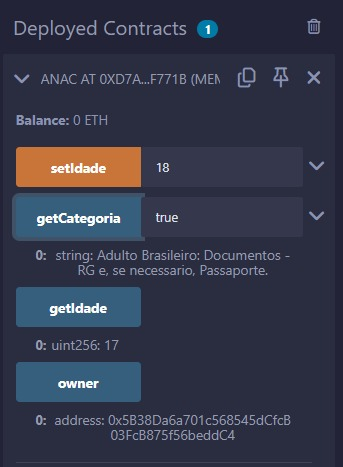
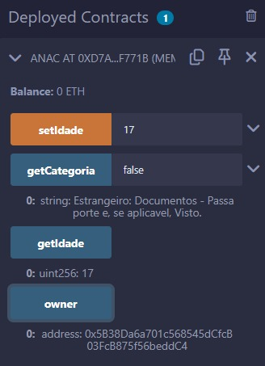
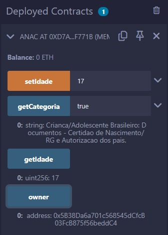

# ponderada-solidity

# Testes

## Teste para verificar se é Adulto e brasileiro

Figura 01 - Adulto e brasileiro 
 
Fonte: Material produzido pelo autor (2025)

## Teste para verificar se é Adulto e brasileiro

Figura 02 - Estrangeiro 
 
Fonte: Material produzido pelo autor (2025)

## Teste para verificar se é Adulto e brasileiro

Figura 03 - Estudante e brasileiro 
 
Fonte: Material produzido pelo autor (2025)

---

## IA

### Prompt

pragma solidity ^0.4.19;

contract Anac {

    uint idade = 18;

    address public owner;

    constructor() public {
        owner = msg.sender;
    }
    

    function setIdade(uint _idade) public {
        require(msg.sender == owner, "Apenas o dono pode alterar a idade.");
        idade = _idade;
    }

    function getIdade() public view returns (uint) {
        return idade;
    }

    function getCategoria(bool isBrasileiro) public view returns (string memory) {
        if (isBrasileiro) {
            if (idade >= 18) {
                return "Adulto Brasileiro: Documentos - RG e, se necessario, Passaporte.";
            } else {
                return  "Crianca/Adolescente Brasileiro: Documentos - Certidao de Nascimento/ RG e Autorizacao dos pais.";
            } 
        } else {
            return "Estrangeiro: Documentos - Passaporte e, se aplicavel, Visto.";
        }
    }

}

----------------------
 comente o código 